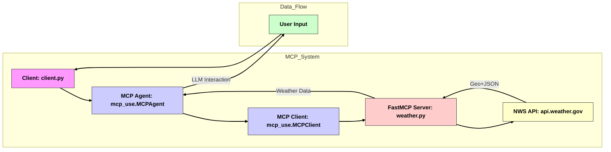

# MCP US Weather Client/Server

This was my first encounter with hands on implementation of MCP, i really liked it & i firmly believe MCP is here to stay, i have to implement some more projects to get more more better understanding about the overall ecosystem,About the repository, This repository contains a simple MCP (Model Context Protocol) server that provides weather alert information for US states, leveraging the National Weather Service (NWS) API.  It also includes an example client application that demonstrates how to interact with the MCP server using the `mcp_use` library and Langchain.


## Features

*   **Weather Alerts:** Fetches and formats active weather alerts for a specified US state.
*   **MCP Integration:**  Demonstrates how to build an MCP server using the `fastmcp` library.
*   **Client Example:** Provides a client application that uses the server and integrates conversation memory.
*   **Langchain Integration:** Example showcases LLM integration.

## Architecture





## Prerequisites

Before running the server and client, ensure you have the following installed:

*   **Python 3.7+**
*   **uv** (recommended for dependency management - [https://github.com/astral-sh/uv](https://github.com/astral-sh/uv))
*   **Groq API key.** This needs to be added to .env file.
*   **`mcp_use` Library:** Make sure you've installed this according to its documentation.

## Installation

1.  **Clone the repository:**

    ```bash
    git clone <your_repository_url>
    cd <repository_directory>
    ```

2.  **Install dependencies (using uv):**

    ```bash
    uv add -r requirements.txt
    ```

    This command uses `uv pip install .` to install the project and its dependencies based on the `pyproject.toml` file in the current directory.

3.  **Create .env file:**
    Create a `.env` file in the root directory with the following content, replacing `<YOUR_GROQ_API_KEY>` with your actual Groq API key:

    ```
    GROQ_API_KEY=<YOUR_GROQ_API_KEY>
    ```

## Usage

### Running the MCP Weather Server & Client

1.  **Start the server:**

    ```bash
    uv run mcp dev server/weather.py
    ```

1.  **Start the Client:**
    ```bash
    uv run server/client.py
    ```


### Interacting with the Client

*   Type your queries at the prompt. For example:  "Get weather alerts for CA, NY or NJ etc".
*   Type `exit` or `quit` to end the conversation.
*   Type `clear` to clear the conversation history.

## Example Interactions


The agent will then use the `get_alerts` tool to fetch weather alerts for California and provide you with the formatted results.

The agent will then use the `get_config` tool to fetch the resource.

## Configuration

### server/weather.json

This configuration file describes the tools and resources exposed by the MCP server.  It's crucial that this file accurately reflects the definitions in your `weather.py` file.  See the `mcp_use` documentation for details on the format of this file.  The default configuration is in the server folder.

### Environment Variables

The client application uses environment variables, specifically `GROQ_API_KEY`, to authenticate with the Groq API.  Make sure to set these variables before running the client. You can set those variables using the `.env` file.


## Output


*   **Console Output:** This screenshot shows the typical output of the client application during a conversation, demonstrating how the agent interacts with the MCP server and utilizes the `get_alerts` tool.

   


*   **MCP Inspector:** This screenshot shows the typical weather.json used with the MCP Inspector

   


## Contact

For any inquiries or support, please reach out:

- **Email:** business@aiankit.com
- **Personal Website:** [aiankit.com](https://aiankit.com)

